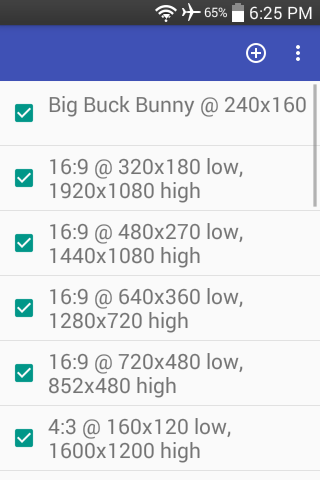
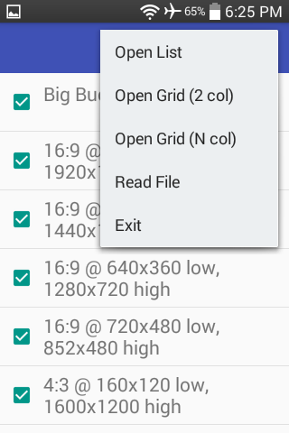
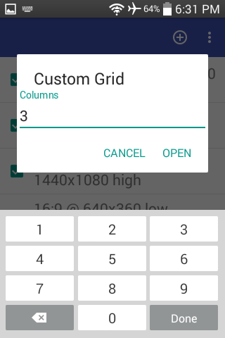
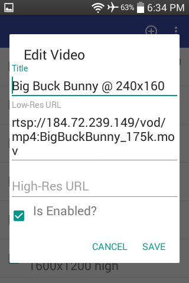
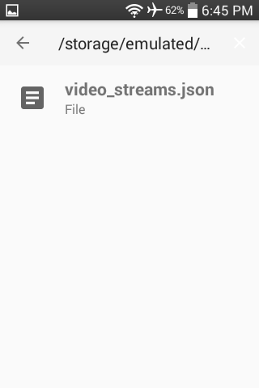
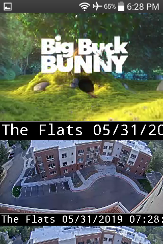
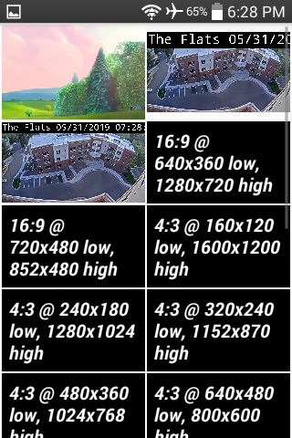
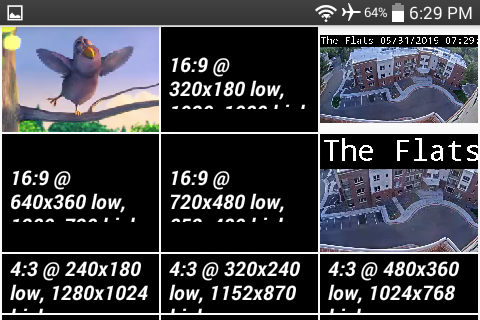
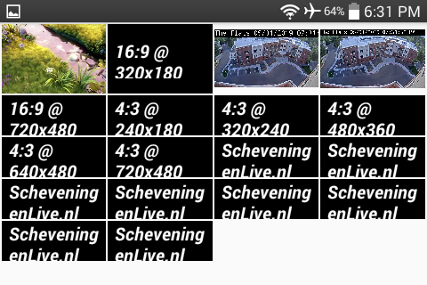

### [RTSP IPCam Viewer](https://github.com/warren-bank/Android-RTSP-IPCam-Viewer)

Android app to watch RTSP and RTMP video streams; these formats are typical of inexpensive IP security cams.

#### Background

* [tinyCam PRO](https://play.google.com/store/apps/details?id=com.alexvas.dvr.pro) by [Tiny Solutions LLC](https://tinycammonitor.com/)
  * is great
  * is the defacto standard for this kind of app
  * is inexpensive ($4 MSRP, occasionally $1 on sale)
  * cons:
    * none
      * this a personal quirk..
        * I prefer to not add Google account(s) to most of my Android devices
* [IP Cam Viewer](https://hit-mob.com/ip-cam-viewer-android/) by [Robert Chou](mailto:robert.chou@gmail.com)
  * has pretty good reviews
  * is the go-to _free_ option for this kind of app
  * available variations:
    * limited functionality w/ ads
      * [_Basic_](https://play.google.com/store/apps/details?id=com.rcreations.ipcamviewerBasic)
        * uses Google's in-app purchase to upgrade
      * [_Lite_](https://play.google.com/store/apps/details?id=com.rcreations.ipcamviewer)
        * uses an unlock code to upgrade
    * full functionality w/o ads
      * [_Pro_](https://play.google.com/store/apps/details?id=com.rcreations.WebCamViewerPaid)
        * $4 MSRP
  * cons:
    * size of APK is over 25MB
    * requires __a lot__ of permissions
    * most buttons/features are crippled
      * open a prompt to purchase pro license
    * basic functionality is (imho) not very impressive
* there are no (good) open-source options

#### Goals

* an extremely light-weight open-source app
  * minimal features
  * minimal UI
* ability to add video streams
  * data structure:
    * required fields:
      * name
      * low-res video stream URL
    * optional fields:
      * high-res video stream URL
      * is enabled?
  * data import methods:
    * manual entry via dialog
    * import via text file ([JSON format](https://github.com/warren-bank/Android-RTSP-IPCam-Viewer/blob/master/.etc/sample_file_import_data/video_streams.json))
* display of enabled video streams:
  * list view of low-res video streams
  * grid view of low-res video streams
    * number of columns is configurable
  * full-screen view of a single high-res video stream
    * (TBD) ability to zoom/pan
    * (TBD) ability to record to external SD card

#### Notes

* minimum supported version of Android:
  * Android 4.1 Jelly Bean (API 16)
* when videos are displayed in list/grid views:
  * Android status bar is visible
  * audio is disabled
  * video playback controls are disabled
* when a video is displayed in full-screen view:
  * Android status bar is hidden
  * audio is enabled
  * video playback controls are enabled

#### Usage

* activity: list of all video streams
  - action bar
    * icon: 
      - click to add new video stream
    * overflow menu: _Open List_
      - display all _enabled_ video streams in a single-column vertical list
    * overflow menu: _Open Grid (2 col)_
      - display all _enabled_ video streams in a two-column grid
    * overflow menu: _Open Grid (N col)_
      - display a dialog to allow the user to specify the integer value of _N_
      - display all _enabled_ video streams in a _N_-column grid
    * overflow menu: _Read File_
      - display a file chooser to allow the user to specify the path to a [JSON file](https://github.com/warren-bank/Android-RTSP-IPCam-Viewer/blob/master/.etc/sample_file_import_data/video_streams.json)
      - parse the JSON to obtain an ordered list of new video streams
      - append the new video streams to the list of all video streams
    * overflow menu: _Exit_
      - exit the application
  - any video stream in the list
    * swipe (left or right) to remove
      - __permanently__ deletes record of the video stream
    * drag (up or down) to change ordered position in list
      - modified order is __persistent__
    * click (single, short) on the checkbox to toggle: _enabled_
    * click (single, short) on the name to edit
* activity: list of all _enabled_ video streams
  - any video stream in the list
    * swipe (left or right) to remove
      - __temporarily__ hides the video stream
      - its record is not altered
      - the video stream will be visible once again when the list is recreated
    * drag (up or down) to change ordered position in list
      - modified order is __temporary__
      - the order of records is not altered
      - the video stream will appear in its original ordered position once again when the list is recreated
    * click (single, long) to toggle: _pause/play_
    * click (single or double, short) to open in full-screen view
* activity: grid of all _enabled_ video streams
  - any video stream in the grid
    * click (single, long) to toggle: _pause/play_
    * click (single or double, short) to open in full-screen view
* activity: full-screen view of a single video stream
  - video surface
    * click (single, short) to toggle: display of the video playback controls
      - which are automatically hidden after a brief timeout

#### Screenshots

<!-- portrait -->

 
<!-- landscape -->

#### Credits

* [ExoPlayer](https://github.com/google/ExoPlayer)
  * video player library that supports RTSP streams
* [MaterialFilePicker](https://github.com/nbsp-team/MaterialFilePicker)
  * library to browse the file system and select a file

#### Legal

* copyright: [Warren Bank](https://github.com/warren-bank)
* license: [GPL-2.0](https://www.gnu.org/licenses/old-licenses/gpl-2.0.txt)
